# DiskAnalyzer — PowerToys Run Plugin & Command Palette Extension

[](https://github.com/valley-soft/powertoys-diskanalyzer/releases/latest)
[](https://apps.microsoft.com/detail/9nf073kltvwn?hl=en-US&gl=US)
[](https://github.com/valley-soft/powertoys-diskanalyzer)
[](https://github.com/microsoft/PowerToys)
[](https://dotnet.microsoft.com/download/dotnet/10.0)
[](https://opensource.org/licenses/MIT)
[](https://github.com/valley-soft/powertoys-diskanalyzer/releases)

A [PowerToys Run](https://aka.ms/PowerToysOverview) plugin **and** a native Windows Command Palette extension that brings **TreeSize-like disk usage analysis** directly into your launcher — plus a full standalone GUI window. Instantly explore drive and folder sizes without leaving your keyboard.

**[🌐 Visit the Official DiskAnalyzer Website](https://valley-soft.github.io/powertoys-diskanalyzer/)**

<div align="center">
  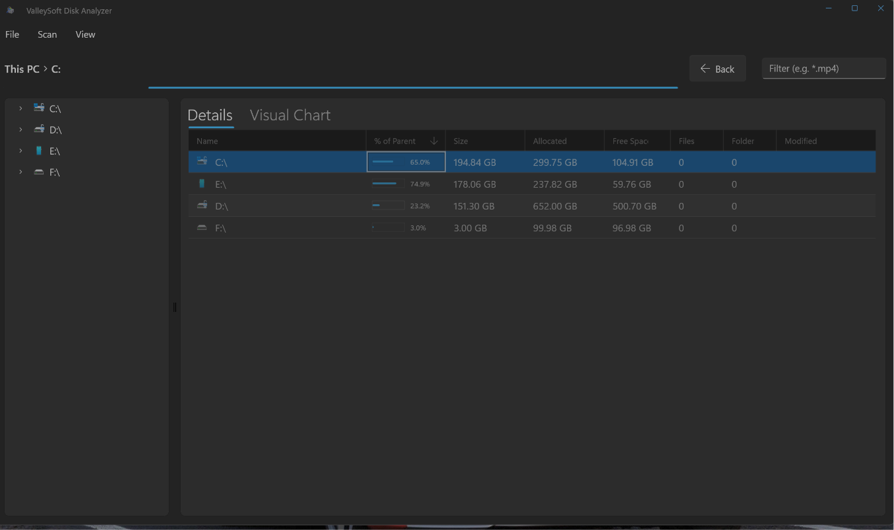
</div>

### 🚀 Install Instantly (Windows 11)
```powershell
winget install ValleySoft.DiskAnalyzer
```
*Or [download the MSIX directly from the Microsoft Store](https://apps.microsoft.com/detail/9nf073kltvwn).*

---

## Components

This project ships three tools, bundled into two easy installations:

| Component | Installation Method | How to trigger |
|-----------|-----------------|----------------|
| **Standalone App (WinUI 3)** & **Command Palette Extension** | Install the `.msix` package | Launch from Start Menu or open Windows Command Palette |
| **PowerToys Run Plugin** | Install the `.exe` installer | Open PowerToys Run (`Alt+Space`) and type `ds` keyword |

---

## Features

### Standalone App (WinUI 3)
- 📊 **Visual Charts**: Instantly visualize disk usage with a beautiful colored Bar Chart
- 🗂️ **Deep Scanning**: Scan any drive or folder to see exact byte-for-byte size analysis
- 📋 **Sortable Data**: View Name, Size, Allocated Size, Items count, and Modified dates
- ⬅️ **Navigation**: Fully integrated back-and-forth history, plus an interactive breadcrumb bar
- 📂 **Integration**: Double-click any folder to drill down, or double-click any file to seamlessly reveal it in Windows Explorer
- 🔒 **Safe**: Read-only tool with absolutely no delete functionality—your data is safe

### PowerToys Run Plugin (`ds` keyword)
- 🖥️ List all drives with used / free / total space and a visual usage bar
- 📂 Browse any folder — subfolders and files ranked by size
- 🔍 Recursively find the largest files inside any path
- 📊 Show top-level subdirectories ranked by total size
- 🔎 Filter files by extension (e.g. find all `.mp4` files)
- 📁 Find empty folders inside any path
- 🪟 Launch the full standalone **GUI window** with one command
- 📋 Context menu: open in Explorer, copy path, copy size, drill down, find largest files
- ⚡ Results cached for 10 seconds — no redundant re-scans

### Command Palette Extension (native CmdPal)
- 🖥️ Type commands directly — no keyword prefix needed
- 📂 Async background scanning — shows a *Scanning…* placeholder while working
- 🔄 Results appear automatically when the scan finishes
- 🖱️ Click any result to drill down interactively
- 📋 Context menu: copy path, copy size, open in Explorer, drill into subfolders

---

## Screenshots

### Standalone App (WinUI 3)

Launch **DiskAnalyzer** from your Windows Start Menu to access the full standalone experience.


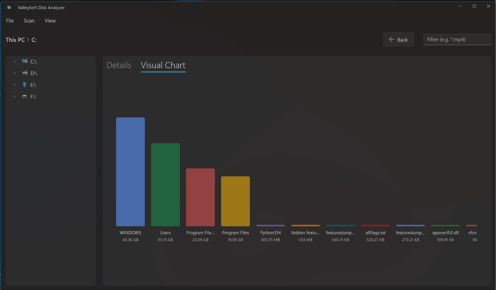

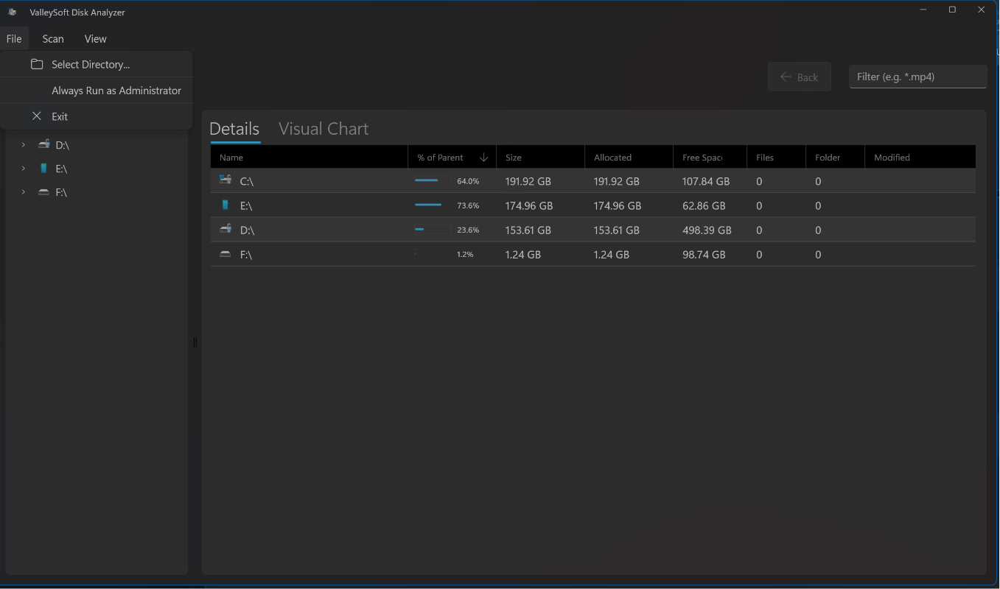
*Note: Enabling the "Always Run as Administrator" toggle is only required the first time. The app will automatically save your preference for all future launches!*

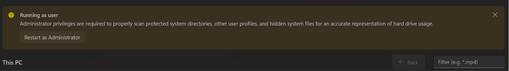

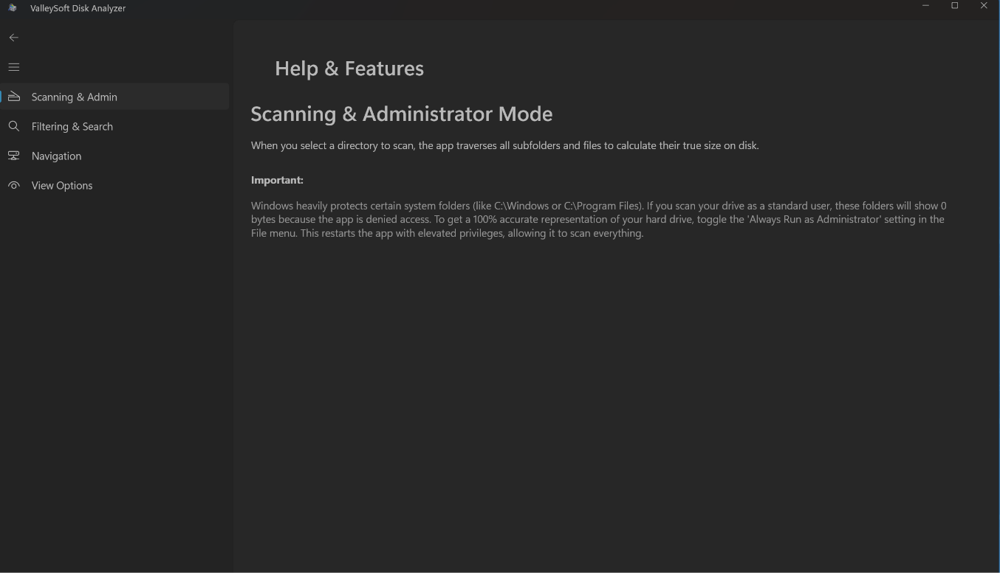

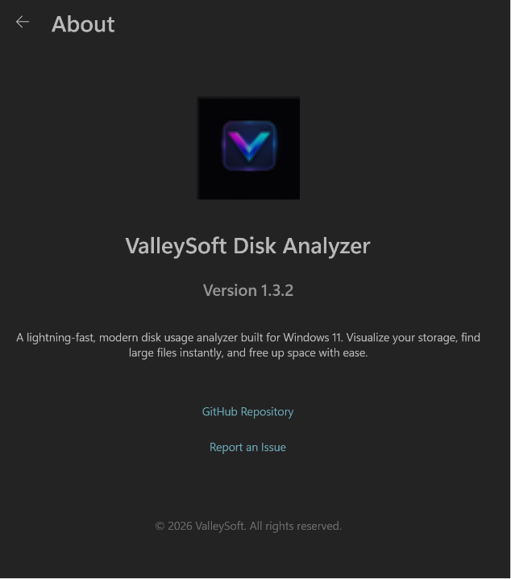

### PowerToys Run Plugin

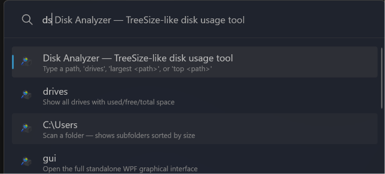

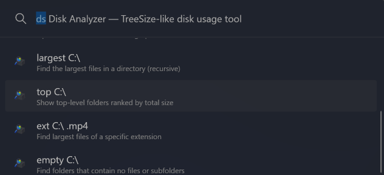

#### Scanning Folders

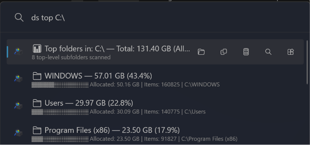

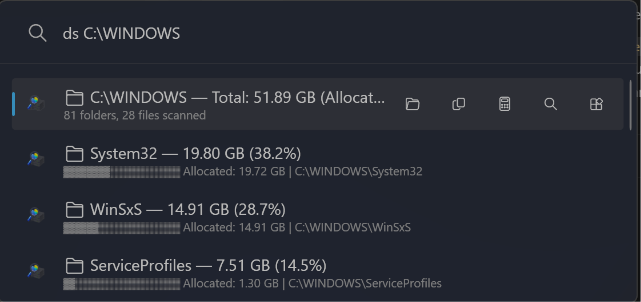

### Command Palette Extension

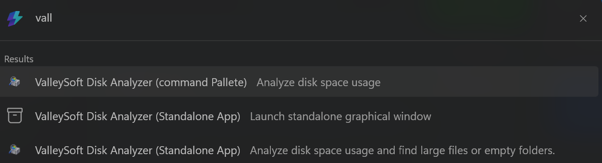
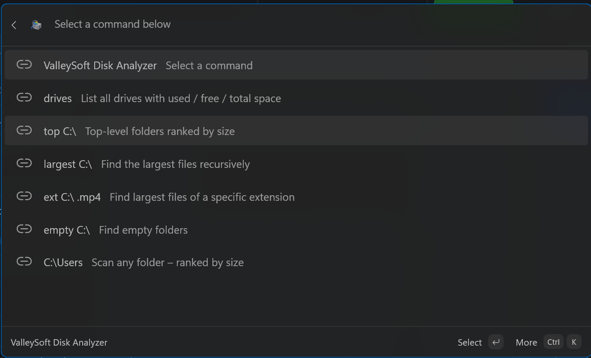
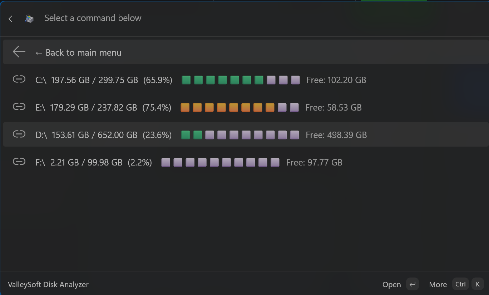

---

## Requirements

- [Microsoft PowerToys](https://github.com/microsoft/PowerToys) v0.97.0 or later
- Windows 10 / 11 (x64 or ARM64)
- .NET 10 Runtime (included with PowerToys)

---

## Installation

### Standalone App (WinUI 3) & Command Palette Extension (Unified MSIX)

1. Download **`ValleySoft.DiskAnalyzer.App_1.3.6_x64.msix`** (or `arm64`) from [Releases](https://github.com/valley-soft/powertoys-diskanalyzer/releases/latest)
2. **Double-click** the `.msix` file — Windows will launch the installer
3. Click **Install** (or **Update**)
4. You're done! The Standalone App will be in your Start Menu, and the Command Palette Extension will automatically be registered in the Windows Command Palette.

> **Recommended:** The Microsoft Store is the easiest way to install and keep the app automatically updated!
>
> [](https://apps.microsoft.com/detail/9nf073kltvwn?hl=en-US&gl=US)
>
> Alternatively, you can install it instantly via the command line using `winget`:
> ```powershell
> winget install --id 9NF073KLTVWN --source msstore
> ```

---

### PowerToys Run Plugin

#### Method 1 — Standalone Installer (Recommended)

1. Download **`ValleySoft.DiskAnalyzerInstaller-v1.3.6-x64.exe`** (or `arm64`) from [Releases](https://github.com/valley-soft/powertoys-diskanalyzer/releases/latest)
2. **Exit PowerToys completely** — Right-click the PowerToys icon in the system tray → **Exit**
3. **Run the installer** — it will automatically extract and copy plugin files to:
   ```
   %LOCALAPPDATA%\Microsoft\PowerToys\PowerToys Run\Plugins\DiskAnalyzer\
   ```
4. **Restart PowerToys** from the Start menu
5. **Enable the plugin** — Open PowerToys Settings → PowerToys Run → Plugins → find **DiskAnalyzer** → toggle **ON**

#### Method 2 — Manual (ZIP)

1. Download the ZIP from [Releases](https://github.com/valley-soft/powertoys-diskanalyzer/releases/latest)
2. Exit PowerToys completely
3. Extract the ZIP to:
   ```
   %LOCALAPPDATA%\Microsoft\PowerToys\PowerToys Run\Plugins\DiskAnalyzer\
   ```
4. Restart PowerToys and enable the plugin in Settings

> **Note:** The unified MSIX package (Standalone App + Command Palette) is self-signed for open-source sideloading. To install it, you must either:
> 1. Enable **Developer Mode** in Windows Settings → System → For developers.
> 2. Or manually trust the certificate by downloading `ValleySoft.cer` from the Releases page, double-clicking it, clicking **Install Certificate**, selecting **Local Machine**, and placing it in the **Trusted Root Certification Authorities** store.

---

### Method 3 — Build from Source

Requires [.NET 10 SDK](https://dotnet.microsoft.com/download/dotnet/10.0).

```powershell
git clone https://github.com/valley-soft/powertoys-diskanalyzer.git
cd powertoys-diskanalyzer
.\build-v1.3.6.ps1
# Installers and MSIX packages appear in out\
```

---

## Usage

### PowerToys Run Plugin

Open PowerToys Run (`Alt+Space`) and type `ds` followed by a command.

| Command | Description |
|---------|-------------|
| `ds` | Show help and all available commands |
| `ds drives` | List all drives with used / free / total space and a usage bar |
| `ds C:\` | Scan a folder — shows subfolders and files sorted by size |
| `ds C:\Users\Photos` | Drill into any subfolder |
| `ds largest C:\` | Find the largest files recursively inside a path |
| `ds top C:\` | Show top-level subfolders ranked by total size |
| `ds ext C:\ .mp4` | Find the largest files of a specific extension |
| `ds empty C:\` | Find empty folders inside a path |
| `ds gui` | Open the legacy WPF GUI window |
| `ds gui C:\Users` | Open the legacy WPF GUI window pre-navigated to a specific folder |

#### Context Menu (right-click / `>` on any result)

| Shortcut | Action |
|----------|--------|
| `Ctrl+O` | Open in File Explorer |
| `Ctrl+C` | Copy path to clipboard |
| `Ctrl+Shift+C` | Copy size to clipboard |
| `Ctrl+Enter` | Drill down into the selected folder |
| `Ctrl+L` | Find largest files inside the selected folder |

#### Tips

- Clicking a folder result automatically prefills `ds <path>` so you can keep drilling down
- Paths with spaces are supported — wrap them in quotes: `ds "C:\My Folder"`
- Results are cached for 10 seconds to avoid redundant re-scans
- The `ds gui` window works independently — you can close PowerToys Run after launching it

---

### Command Palette Extension

Open the Windows Command Palette and click **ValleySoft Disk Analyzer** (or search for it). Then type directly:

| Command | Description |
|---------|-------------|
| `drives` | List all drives with used / free / total space |
| `top C:\` | Top-level folders ranked by size |
| `largest C:\` | Find the largest files recursively |
| `ext C:\ .mp4` | Find largest files of a specific extension |
| `empty C:\` | Find empty folders |
| `C:\Users` | Scan any absolute folder path — ranked by size |

Results appear **as you type** — scanning runs in the background with a *Scanning…* placeholder and updates automatically when done. Click any result to drill down interactively.

---

## Standalone App — How to Use

Launch **DiskAnalyzer** from your Windows Start Menu.

| Action | How |
|--------|-----|
| Scan a drive | Click the drive letter from the dropdown or sidebar |
| Pick a custom folder | Click **Browse...** to pick any folder on your PC |
| View visual charts | Click the **Chart** icon in the toolbar |
| Drill into a subfolder | **Double-click** any folder row in the data grid |
| Reveal a file | **Double-click** any file row — opens File Explorer |
| Go back | Click the **← Back** button or use the breadcrumb trail |
| Rescan current view | Click the **Refresh** button |
| Sort columns | Click any column header (Size/Allocated sort correctly by bytes) |

---

## Settings

Configure in PowerToys Settings → PowerToys Run → DiskAnalyzer.

| Setting | Default | Description |
|---------|---------|-------------|
| Maximum results | 15 | Number of items to display (5–50) |
| Default scan depth | 1 | How many levels deep to scan (1–5) |
| Include hidden files | Off | Include items with the Hidden attribute |
| Show percentage of parent | On | Display what % of the parent each item uses |

---

## Project Structure

| File / Folder | Purpose |
|---------------|---------| 
| `Main.cs` | Plugin entry point — handles queries, results, and context menus |
| `Core/` | Shared class library containing the disk scanning engine |
| `Standalone App/` | WinUI 3 standalone application |
| `DiskAnalyzerWindow.xaml` / `.cs` | Legacy standalone GUI window (WPF) triggered via `ds gui` |
| `plugin.json` | PowerToys metadata (name, keyword, version, icons) |
| `docs/Images/` | README screenshots |
| `Images/` | Plugin icon assets (`DiskAnalyzerLight.png` / `DiskAnalyzerDark.png`) |
| `CmdPalExtension/` | Native Command Palette MSIX extension project |
| `Installer/` | Single-file native installer source |
| `build-v1.3.1.ps1` | Build script — compiles PT Run plugin + CmdPal MSIX + Standalone MSIX for x64 & ARM64 |
| `out/` | Final output directory for all generated artifacts |

---

## Roadmap

Looking to see what's coming next? Check out our official **[Project Roadmap](ROADMAP.md)** for our bi-weekly release schedule and upcoming features!

---

## Version History

### v1.3.6 — 2026-07-18

#### Fixed
- 🛠️ **Fixed**: Fixed a bug where scanning the drives list would instantly crash the Command Palette extension if a drive was locked by BitLocker or otherwise inaccessible.
- 🛠️ **Fixed**: Fixed a major issue causing the Command Palette extension to stay alive in the background and refuse to suspend (HANG_QUIESCE).
- 📦 **Fixed**: Fixed the installer displaying the wrong version and title in its UI.

### v1.3.5 — 2026-07-13

#### Added
- ✨ **New**: Added a right-click context menu to the scan grid (Open in Explorer, Copy Path).
- ✨ **New**: Added an editable address bar (double-click the breadcrumbs to type or paste any directory path).
- ✨ **New**: Added an "Up one level" option and keyboard shortcuts to the Command Palette extension.

#### Fixed
- 📦 **Fixed**: Completely separated the PowerToys Run Plugin (.exe installer) from the Standalone App and Command Palette (.msix) to prevent conflicts.
- 🛠️ **Fixed**: Resolved manual MSIX installation certificate verification errors (`0x800B010A`).
- 🚀 **Fixed**: Restored smooth, continuous real-time progress updates in the scanning grid.
- 🛠️ **Fixed**: Fixed random application crashes when scanning deep or highly complex folder trees.
- 🚀 **Fixed**: Prevented startup UI freezes by moving drive scans and icon loading to background threads.
- 🧹 **Fixed**: Fixed resource cleanup bugs to prevent memory leaks during long scan sessions.
- 🛡️ **Fixed**: Removed unnecessary app permission requirements for improved security and privacy.
- ♿ **Fixed**: Added screen-reader tags to navigation buttons.

### v1.3.3 — 2026-06-26

#### Added
- ✨ **New**: Completely redesigned the Standalone App's Help & Features section using a native WinUI `NavigationView` for a premium experience.
- ✨ **New**: Added a dedicated About page featuring the app version, copyright, and direct GitHub links.
- ✨ **New**: Updated navigation icons.

#### Fixed
- 🛠️ **Fixed**: Fixed a bug where the "Always Run as Administrator" toggle was incorrectly disabled when running elevated.

### v1.3.1 — 2026-06-24

#### Added
- ✨ **New**: Added an **"Always Run as Administrator"** toggle to the Standalone App's File menu, which automatically saves your preference and natively relaunches the app via UAC.
- ✨ **New**: **Live UI Streaming** — The Standalone App now populates folders incrementally in real-time as the scan progresses, exactly like TreeSize Free!

#### Changed
- 🚀 **Extreme Performance Optimization**: Refactored the core scanning engine to eliminate blocking array allocations and bypass millions of heavy P/Invoke and string operations. SSD scanning speeds have been radically improved, effectively resolving UI hangs and slow scans.
- 🛡️ **Admin Integration**: Restructured the app manifests so that elevated privileges are optional via the UI toggle instead of forcing UAC prompts on every launch.

### v1.3.0 — 2026-06-21

#### Added
- ✨ **New**: **Fully featured Standalone WinUI 3 App** with a beautiful visual Bar Chart for deeper disk analysis!
- 📦 **New**: **Unified Installer** features a flawless 1-click Clean Install mode, automatically purging old DLLs from `%LOCALAPPDATA%` to prevent version conflicts.
- 📦 **New**: **Unified the Command Palette Extension and Standalone App into a single MSIX package** for seamless Microsoft Store distribution.
- 🏷️ **New**: Completely separated and distinct display names for the Standalone App, Command Palette Extension, and PowerToys Run plugin to eliminate confusion.

#### Changed
- 🚀 **Performance**: Upgraded the Core project and shared logic to **.NET 10.0** for maximum performance and modern API support.
- 🏗️ **Architecture**: Extracted the shared core scanning engine into a perfectly synchronized standard, improving accuracy and maintainability.
- 🧹 **Cleanup**: Deeply cleaned the repository, permanently ignoring and removing old legacy build artifacts.

#### Fixed
- 🛠️ **Fixed**: PowerToys Run `AssemblyLoadContext` bug completely resolved! Core logic is now natively compiled directly into the plugin instead of using `ProjectReference`.
- 🛠️ **Fixed**: Standalone App sizes and calculations rigorously synced with Windows Explorer to ensure accurate byte-for-byte size reporting.
- 🛠️ **Fixed**: Resolved hidden files straggler toggles in XAML and WPF; hidden system files are now properly counted and interactable.
- 🛠️ **Fixed**: Fixed severe junction point infinite loop bugs in the directory scanner.

### v1.2.0 — 2026-06-14
- ✨ **New**: Native **Command Palette MSIX Extension** — type commands directly in CmdPal without a keyword
  - Async background scanning with live *Scanning…* placeholder
  - Interactive drill-down by clicking results
  - Supports `drives`, `top`, `largest`, `ext`, `empty`, and any folder path
- ✨ **New**: Standalone GUI window (`ds gui`) with full drive/folder tree explorer
  - Expandable left tree pane showing all drives
  - Right grid with sortable Name, Size, Allocated, Items, Modified columns
  - Double-click to drill down into folders
  - Double-click files to reveal in File Explorer
  - ← Back navigation, Browse folder picker, Refresh
  - Sizes sort correctly by bytes (not alphabetically)
- ✨ **New**: `ds ext <path> <extension>` — find largest files by extension
- ✨ **New**: `ds empty <path>` — find empty folders
- ✨ **New**: ARM64 support — separate installer and MSIX for ARM64 devices
- ✨ **New**: PowerToys Run plugin labeled *DiskAnalyzer (PowerToys Run)* in CmdPal to distinguish from the MSIX extension
- 🛠️ **Fixed**: Disk used space now matches Windows Explorer exactly
- 🛠️ **Fixed**: Folder size calculation uses queue-based BFS (avoids reparse points)
- 📦 **New**: Single-file native `.exe` installer for both x64 and ARM64
- 📦 **New**: MSIX packages for Command Palette extension (x64 and ARM64)

### v1.1.0 — 2026-06-10
- Updated target framework to net10.0-windows
- Fixed missing plugin icons in PowerToys settings
- Added allocated on-disk size to scan results
- Improved scanning performance with parallel processing

### v1.0.2 — 2026-05-24
- Updated target framework to net9.0-windows
- Updated Community.PowerToys.Run.Plugin.Dependencies to v0.97.0
- Compatible with PowerToys v0.97.0 and later

### v1.0.1
- Bug fixes and stability improvements

### v1.0.0
- Initial release
- List drives with used / free / total space
- Browse folder sizes ranked by largest
- Recursive largest file/folder search
- Cloud folder support (iCloud, OneDrive)

---

## Contact

For support, feedback, or business inquiries, please reach out via email:
**📧 valleysoftdev29@gmail.com**

---

## License

[MIT](https://opensource.org/licenses/MIT) © [ValleySoft](https://github.com/valley-soft)

