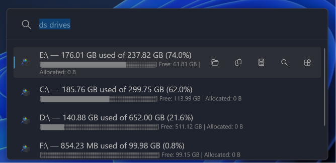
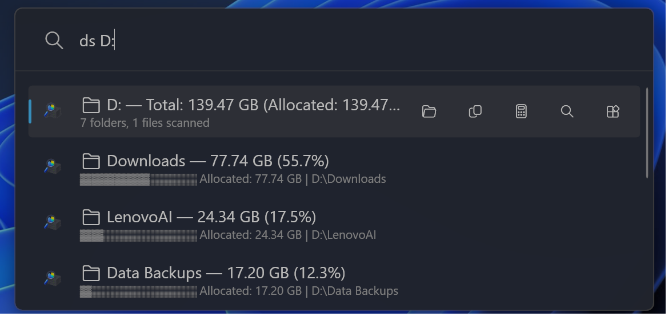

# DiskAnalyzer - PowerToys Run Plugin

[](https://github.com/thetsaw/PowerToys.Plugin/releases/latest)
[](https://github.com/thetsaw/PowerToys.Plugin)
[](https://github.com/microsoft/PowerToys)
[](https://dotnet.microsoft.com/download/dotnet/10.0)
[](https://opensource.org/licenses/MIT)
[](https://github.com/thetsaw/PowerToys.Plugin/releases)

A [PowerToys Run](https://aka.ms/PowerToysOverview) plugin that brings **disk usage analysis** directly into your launcher. Instantly explore drive and folder sizes without leaving your keyboard.




## Features

- List all drives with used / free / total space
- Browse any folder and see children ranked by size
- Recursively find the largest files and folders inside any path
- Accurate sizes for cloud folders (iCloud, OneDrive)
- Keyboard-first: clicking a result keeps the `ds` prefix so you can keep drilling down

## Requirements

- [Microsoft PowerToys](https://github.com/microsoft/PowerToys) v0.97.0 or later
- Windows 10 / 11 (x64 or ARM64)

## Installation

1. Download the zip for your architecture from [Releases](https://github.com/thetsaw/PowerToys.Plugin/releases/latest)
2. **Close PowerToys completely** — Right-click the PowerToys icon in the system tray and select **Exit**.
3. **Extract** the downloaded zip file.
4. **Copy** the extracted `DiskAnalyzer` folder into: `%LOCALAPPDATA%\Microsoft\PowerToys\PowerToys Run\Plugins`
5. **Restart PowerToys** from the Start menu.
6. **Enable the plugin** — Open PowerToys Settings → PowerToys Run → Plugins → find **DiskAnalyzer** → toggle **ON**.
7. *(Optional)* Enable **"Include in global result"** to activate global mode. Once enabled, press `Alt+Space`, type `ds` and select a drive letter (e.g. `C:`, `D:`) to instantly scan that drive — no keyword prefix needed.


## Usage

Open PowerToys Run (`Alt+Space`) and type `ds` followed by a command.

### Commands

| Command | Description |
|---------|-------------|
| `ds` | Show help and all available commands |
| `ds drives` | List all drives with used / free / total space and a usage bar |
| `ds C:\` | Scan a folder — shows subfolders and files sorted by size |
| `ds C:\Users\Photos` | Drill into any subfolder |
| `ds largest C:\` | Find the largest files recursively inside a path |
| `ds top C:\` | Show top-level subfolders ranked by total size |

### Context Menu (right-click any result)

| Shortcut | Action |
|----------|--------|
| `Ctrl+O` | Open in File Explorer |
| `Ctrl+C` | Copy path to clipboard |
| `Ctrl+Shift+C` | Copy size to clipboard |
| `Ctrl+Enter` | Drill down into the selected folder |
| `Ctrl+L` | Find largest files inside the selected folder |

### Tips

- Clicking a folder result automatically prefills `ds <path>` so you can keep drilling down without retyping
- Paths with spaces are supported — wrap them in quotes: `ds "C:\My Folder"`
- Results are cached for 10 seconds to avoid redundant re-scans

## Settings

Configure in PowerToys Settings → PowerToys Run → DiskAnalyzer.

| Setting | Default | Description |
|---------|---------|-------------|
| Maximum results | 15 | Number of items to display (5–50) |
| Default scan depth | 1 | How many levels deep to scan (1–5) |
| Include hidden files | Off | Include items with the Hidden attribute |
| Show percentage of parent | On | Display what % of the parent each item uses |

## Building from Source

Requires [.NET 10 SDK](https://dotnet.microsoft.com/download/dotnet/10.0).

```bash
git clone https://github.com/thetsaw/PowerToys.Plugin.git
dotnet publish -c Release -r win-x64 --self-contained false -o publish/x64
dotnet publish -c Release -r win-arm64 --self-contained false -o publish/arm64
```

## Version History

### v1.1.0 - 2026-06-10
- Updated target framework to net10.0-windows
- Fixed missing plugin icons in PowerToys settings
- Added allocated on-disk size to scan results
- Improved scanning performance with parallel processing

### v1.0.2 - 2026-05-24
- Updated target framework to net9.0-windows
- Updated Community.PowerToys.Run.Plugin.Dependencies to v0.97.0
- Compatible with PowerToys v0.97.0 and later

### v1.0.1
- Bug fixes and stability improvements

### v1.0.0
- Initial release
- List drives with used / free / total space
- Browse folder sizes ranked by largest
- Recursive largest file/folder search
- Cloud folder support (iCloud, OneDrive)


## Project Structure

Here is a breakdown of the key files and folders in this repository:

### Code & Core Logic
*   **`Main.cs`**: The entry point of the plugin. Hooks into PowerToys Run, processes search queries, formats results, and handles Context Menu actions.
*   **`DiskAnalyzerHelper.cs`**: Contains the background logic for scanning the file system, calculating exact/allocated sizes using Windows APIs, parallel task processing, and generating visual progress bars.
*   **`DiskItemInfo.cs`**: The data model representing a scanned file or folder (stores Name, Path, Actual Size, Allocated Size, etc.).

### Configuration & Settings
*   **`plugin.json`**: PowerToys metadata file defining the plugin's name, activation keyword (`ds`), version, and icon locations.
*   **`Community.PowerToys.Run.Plugin.DiskAnalyzer.csproj`**: The .NET project file. Tells the compiler how to build the code, target .NET framework version, and manages dependencies.
*   **`Images/`**: Contains the visual icon assets (`DiskAnalyzerLight.png` and `DiskAnalyzerDark.png`) displayed in the PowerToys Run search bar.

### Build & Release
*   **`build-v1.1.0.ps1`**: PowerShell script to automate compiling the C# code, stripping unnecessary DLLs, packaging release ZIPs, and installing the plugin locally for testing.
*   **`DiskAnalyzer-1.1.0-x64.zip` / `DiskAnalyzer-1.1.0-ARM64.zip`**: The compiled, ready-to-distribute release packages.

### Repository Files
*   **`README.md`**: The front-page documentation.
*   **`.gitignore`**: Defines files that Git should not track (e.g., `bin/` and `obj/` build artifacts). Note: Release ZIPs are forcefully tracked for distribution.
*   **`LICENSE`**: The MIT License file.
*   **`ptrun-lint.log`**: A log file generated by a linter or formatting tool checking for code style/syntax issues.


## License

[MIT](https://opensource.org/licenses/MIT) © [thetsaw](https://github.com/thetsaw)

 